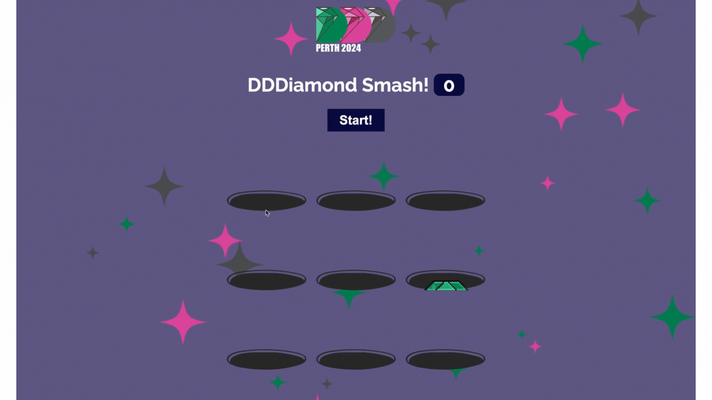

# Cupcake Smash

Welcome to our She Codes Australia / DDD Perth collaboration. We've put together a fun little mini game for you to do in the lead up to DDD Perth on November 16th. The tutorial should take about 60 minutes, building out just the Javscript component of our diamond smashing game. At the end, you'll have the option to submit your work, with the best few displayed on the She Codes stand at DDD Perth for the whole world to play.

Its world domination... ish.

A preview of the end result is below:

Ready to get started? Awesome! Proceed to Step 1.

New to coding? No problem! Let's begin with a short video about HTML, CSS and JavaScript, the three programming languages that we use to build websites and will be referencing throughout this tutorial.


