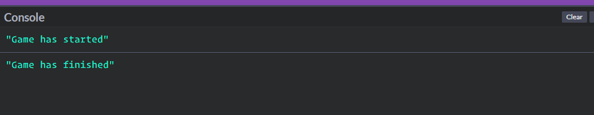

+++
title = "Step 2"
weight = 1
chapter = true
pre = ""
+++

# Creating our Variables

To start off, we're going to grab some of the elements on the page, and save them in a [variable](https://developer.mozilla.org/en-US/docs/Learn/JavaScript/First_steps/Variables#what_is_a_variable) so we can access them easily later.  A variable is basically a container for storing a value where the contained value can change. 

We are going to be using some functions to get our variables, that enable us to create our variables based on the content on our page. In particular we'll be using the [`querySelector`](https://developer.mozilla.org/en-US/docs/Web/API/Document/querySelector) and [`querySelectorAll`](https://developer.mozilla.org/en-US/docs/Web/API/Document/querySelectorAll) functions. These use CSS selectors (don't worry if you don't know what that is!) so they can easily be used to reference HTML elements. The `querySelector` function will fetch the first element that matches our specified selector, and `querySelectorAll` will fetch all of the matching elements and return a list.

If you already know some basic HTML & CSS, you'll already be familiar with CSS Selectors such as Classes and ID's. If you're not don't stress about it too much - We'll be telling you which selectors to use, and you can find out more about them by taking [our HTML & CSS tutorial](https://shecodes-tutorials.netlify.app/html_and_css_intro/) when you've got more time! For now, all you need to know is that we are going to use two classes ('hole' and 'score') to define our variables.

We can create our variables by declaring and initialising them, which we do using the syntax:

```js
let somevariable = value;
```

Our variable names are going to be 'holes' and 'scoreBoard' and we are going to declare them using the following code. To do this, simply copy and paste the below code into the JavaScript window in your CodePen!

```js
let holes = document.querySelectorAll('.hole');
let scoreBoard = document.querySelector('.score');
```

We're also going to define another variable that we'll be using later called `timeUp`, which we'll use to stop the game at the end of the allotted time. This will just be a true or false (also known as 'Boolean') variable and we are going to set it to false to start with.

```js
let timeUp = false
```

# Creating our Start & End Functions

Next we're going to create a function to run when someone clicks the **Start** button. We are going to call the function `startGame` and if you take a look at the HTML code in the top box, you will notice that we've actually already instructed your button to run this function when it is clicked. All you need to do is actually create the function, and tell it what to do. For now we're going to ask it to log a message to the console when the game has started, and then use the [`setTimeout`](https://developer.mozilla.org/en-US/docs/Web/API/WindowOrWorkerGlobalScope/setTimeout) method to run another function called `endGame` after a delay of 10000ms.

```js
function startGame() {
	console.log('Game has started')
	
	setTimeout(endGame, 10000)
}
```

We also need to define the `endGame` function, which is what runs after the setTimeout reaches your specified delay. For now we're also going to simply log a message to the console, like we did for `startGame`.

```js
function endGame() {
	console.log('Game has finished')
}
```

In the bottom left corner of your Codepen, click on **Console** to open the console. Try clicking the **Start** button and wait a minute to see what happens!



If you'd like to learn more about variables or functions (what we just used) you can read more about them in more detail here:  
[variables](https://developer.mozilla.org/en-US/docs/Learn/JavaScript/First_steps/Variables)  
[functions](https://developer.mozilla.org/en-US/docs/Learn/JavaScript/Building_blocks/Functions)
